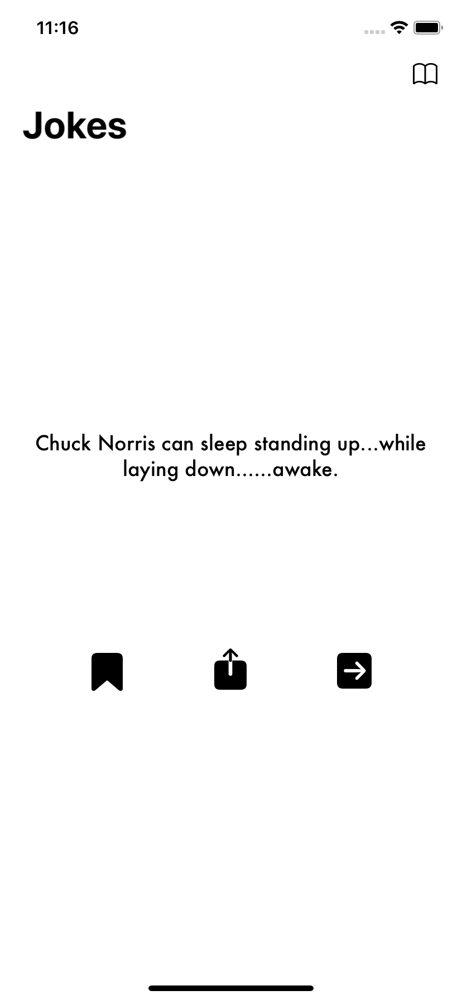
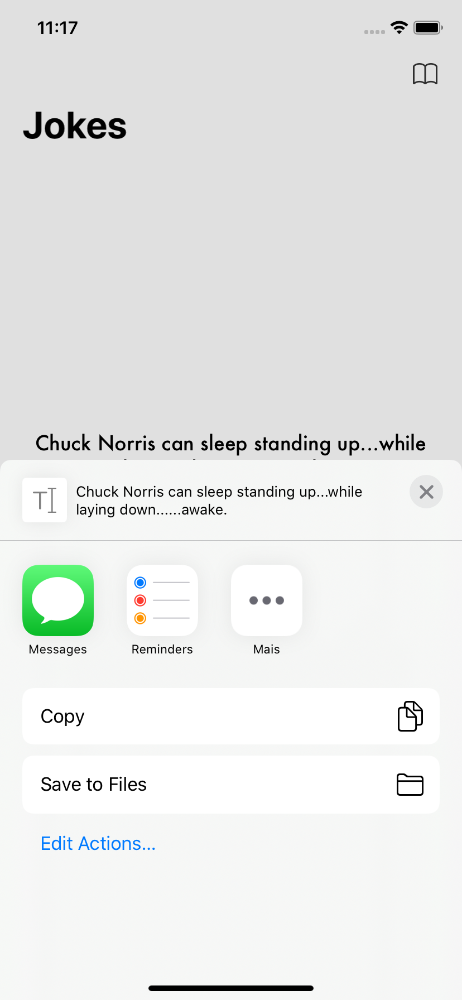
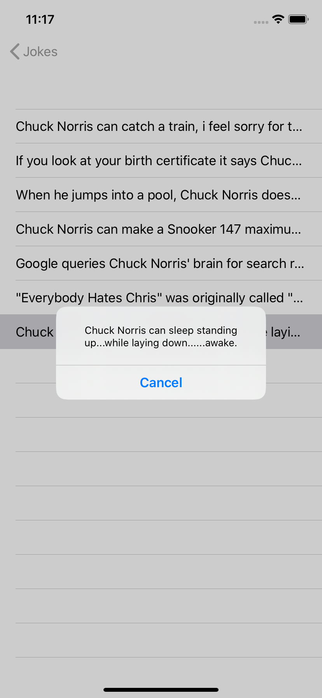
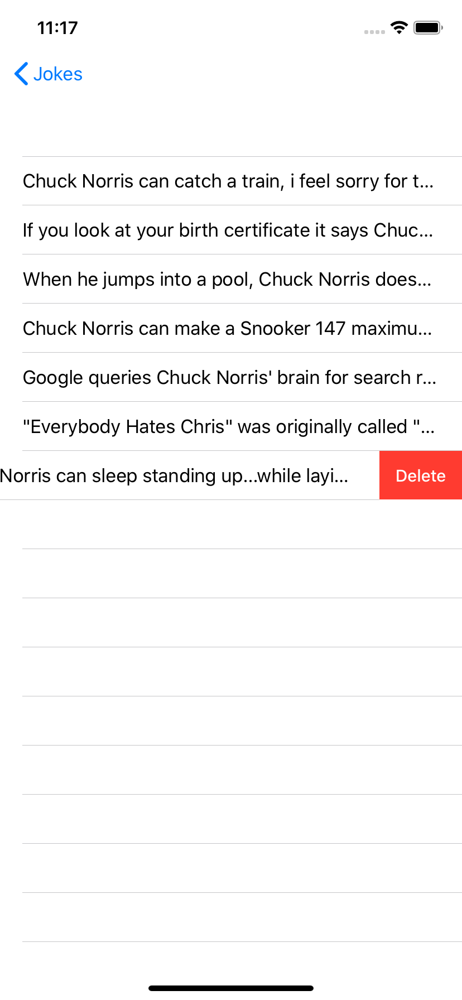

# Fatos-de-ChuckNorris
Esse projeto foi desenvolvido com o intuito de colocar as tecnologias e frameworks aprendidos em prática.

Arquiteutura utilizada [MVC](https://www.devmedia.com.br/introducao-ao-padrao-mvc/29308)

Bibliotecas internas:
- [Codable](https://developer.apple.com/documentation/foundation/archives_and_serialization/encoding_and_decoding_custom_types)
- [CoreData](https://developer.apple.com/documentation/coredata)

Bibliotecas Externas:
- [Alamofire](https://github.com/Alamofire/Alamofire)

## Funcionamento
Na primeira tela do app é exibida uma piada da API [Chuck Norris Jokes Api](https://api.chucknorris.io/), onde possuem quatro botões:
- Salvar, compartilhar, exibir a próxima piada e a lista de piadas. Onde será exibido as piadas que foram salvas.
- Na lista de piadas, é possível visualiza-lá e também exclui-lá.

## Piadas
         

## Build do app em sua máquina
Antes de abrir o app na máquina, é necessário:

Xcode 11.5 ou superior. 
Ter o cocoapods instalado.

Você pode acompanhar o passo a passo pra instalar aqui [CocoaPods](https://cocoapods.org/)

Depois de instalar, abra a pasta do projeto e digite o comando:
- pod install
